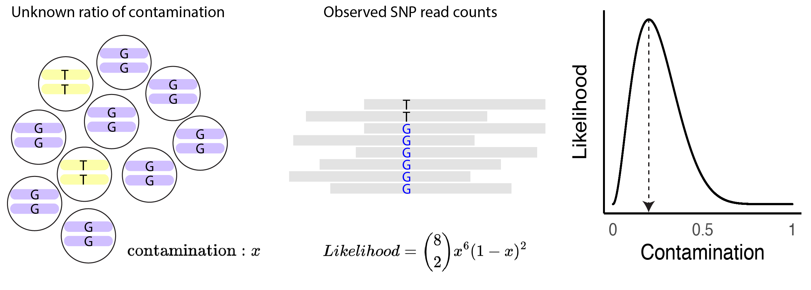

Introduction
=====

.. _run:

Introduction
------------

TrioMix is a bioinformatics software that quantifies within-family DNA contamination, chimerism, and uniparental disomy from a sequence data of family trio. From the genotypes of the family members, TrioMix builds a maximum likelihood estimation model to accurately quantify DNA contamination by measuring the deviation from the Mendelian inheritance. 

If the genotypes of the parents are known, then the offspring's genotype can be inferred. Thus, the VAF of uncontaminated offspring can be estimated from the parental genotypes. If there is contamination, then there would be a deviation from the expected VAFs which can be measured with maximum likelihood estimation.

.. Detection of parental DNA contamination in the offspring
.. ------------

.. Detection of sibling's DNA contamination in the offspring
.. ------------

.. Detection of offspring's DNA contamination in the parent
.. ------------

.. Detection of contamination between the parents
.. ------------

