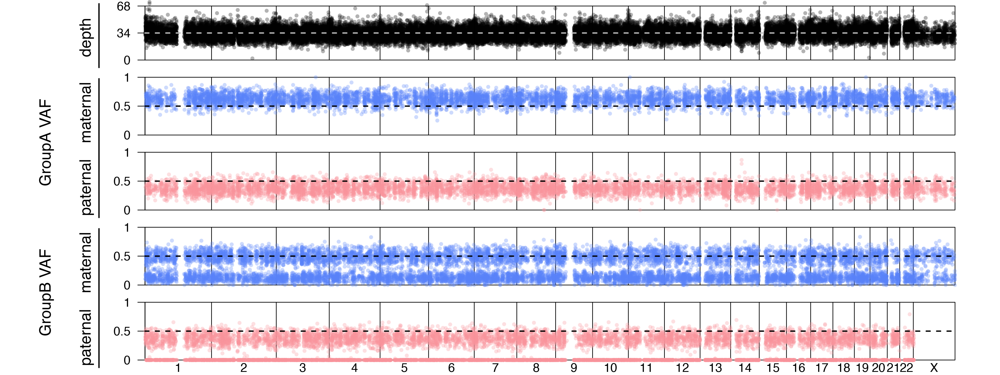
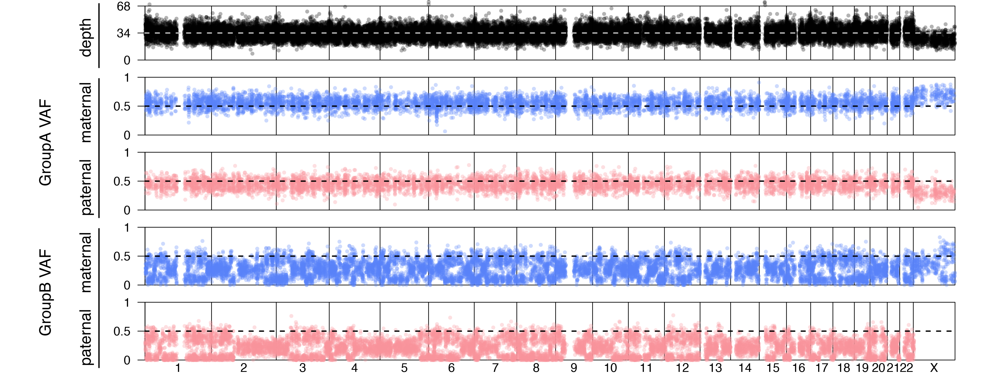

Example
=====

.. _example:

Example workflow
------------
Contamination can be simulated by randomly selecting read sequences from two BAM (or CRAM) files at a defined ratio. The total number of reads in each bam file is adjusted when creating a subsampled BAM file which is later merged into a single 'contaminated' bam file.

Test run with 1000 genomes trio
------------
In our `github <https://github.com/cjyoon/triomix/tree/master/test.sh>`_ a test script ``test.sh`` is provided which can created a simulated contamination BAM files from a 1000 genomes family. 

.. code-block:: bash

   $ sh test.sh

This will download the 1000 genomes trio CRAM files, create simulated contamination files by subsampling. Note this will requires ``samtools`` to be installed in your ``$PATH``. Below, a few example cases in the ``test.sh`` are described.

Download a 1000 genomes trio (+ a sibling) CRAM files
------------
The following command downloads a 1000 genomes trio (+ a sibling) into current working directory

.. code-block:: bash

  # download M008 family's WGS from 1000 genomes project ftp.
  # proband
  wget -nc ftp://ftp.sra.ebi.ac.uk/vol1/run/ERR398/ERR3989418/NA19662.final.cram  -O proband.cram
  wget -nc ftp://ftp.sra.ebi.ac.uk/vol1/run/ERR398/ERR3989418/NA19662.final.cram.crai  -O proband.cram.crai

  # father
  wget -nc ftp://ftp.sra.ebi.ac.uk/vol1/run/ERR323/ERR3239902/NA19661.final.cram -O father.cram
  wget -nc ftp://ftp.sra.ebi.ac.uk/vol1/run/ERR323/ERR3239902/NA19661.final.cram.crai -O father.cram.crai

  # mother
  wget -nc ftp://ftp.sra.ebi.ac.uk/vol1/run/ERR398/ERR3989417/NA19660.final.cram -O mother.cram
  wget -nc ftp://ftp.sra.ebi.ac.uk/vol1/run/ERR398/ERR3989417/NA19660.final.cram.crai -O mother.cram.crai

  # sibling
  wget -nc ftp://ftp.sra.ebi.ac.uk/vol1/run/ERR398/ERR3989425/NA19685.final.cram -O sibling.cram
  wget -nc ftp://ftp.sra.ebi.ac.uk/vol1/run/ERR398/ERR3989425/NA19685.final.cram.crai -O sibling.cram.crai

  # download the reference fasta file
  wget -nc https://storage.googleapis.com/genomics-public-data/resources/broad/hg38/v0/Homo_sapiens_assembly38.fasta
  samtools faidx Homo_sapiens_assembly38.fasta

Offspring DNA contaminated by mother's DNA
------------
The following scripts create a simulated contamination consisting of 75% offspring's DNA + 25% mother's DNA. ``SCRIPTPATH`` should be set to the folder where ``triomix.py`` is located. 

.. code-block:: bash
  
  SCRIPTPATH=/path/to/triomix # change this to triomix's github folder path. This is automatically detected in test.sh
  
  #################################
  # offspring contaminated by mother simulation
  python $SCRIPTPATH/simulate_familial_mixture.py \
   -f father.cram \
   -m mother.cram \
   -c proband.cram \
   -s sibling.cram \
   -r 0 0.25 0.75 0 -o offspring75_mother25 # 0% father, 25% mother, 75% offspring 0% sibling 

  # run TrioMix on offspring contaminated by mother
  python $SCRIPTPATH/triomix.py \
   -f father.cram \
   -m mother.cram \
   -c offspring75_mother25/familymix.bam \
   -r Homo_sapiens_assembly38.fasta -t 8 \
   -s $SCRIPTPATH/common_snp/grch38_common_snp.bed.gz \
   -p offspring75_mother25 -o results

This will produce the contamination estimation file ``offspring75_mother25.child.counts.summary.tsv``

.. code-block:: console

  $ cat offspring75_mother25.child.counts.summary.tsv
  type  value
  child_contam_by_sibling_joint 1.8873588344360515e-4
  child_contam_by_father_joint  8.167772506667559e-5
  child_contam_by_mother_joint  0.2507938532424764
  convergence_joint 0
  child_contam_by_sibling 0.2533023916508015
  child_contam_by_father  6.474095861474213e-9
  child_contam_by_mother  0.2507121759058531
  groupA_father  73041
  groupA_mother  73077
  groupB_father  125753
  groupB_mother  124975
  denovo_error_rate 3.992565674974727e-4

Joint estimation assuming all possible contamination from all family members estimated 25% contamination only from the mother. However, if we look at the estimation assuming only one individual at a time, fitting the same data may show maximum likelihood with 25% contamination by the father and also 25% contamination of the  mother. Thus, the joint method provides the most definitive contamination estimation.

A genome wide plot for this simulated case is shown. 

Offspring DNA contaminated by father, mother, and a sibling
------------
Here, we simulate a complex case where the offspring's DNA is coontaminated by the father, mother, and a sibling simultaneously.

.. code-block:: console

  ##################################
  # multiple contamination simulation, father=10%, mother=20%, offspring=40%, sibling=30%
  python $SCRIPTPATH/simulate_familial_mixture.py \
   -f father.cram \
   -m mother.cram \
   -c proband.cram \
   -s sibling.cram  \
   -r 0.10 0.20 0.40 0.30 -o complexmix # 10% father, 20% mother, 40% offspring 30% sibling 

  # run TrioMix on the complex contaminated case
  python $SCRIPTPATH/triomix.py \
   -f father.cram \
   -m mother.cram \
   -c complexmix/familymix.bam \
   -r Homo_sapiens_assembly38.fasta -t 8 \
   -s $SCRIPTPATH/common_snp/grch38_common_snp.bed.gz \
   -p complexmix -o results

This will produce the contamination estimation file ``complexmix.child.counts.summary.tsv``

.. code-block:: console

  $ cat complexmix.child.counts.summary.tsv
  type  value
  child_contam_by_sibling_joint 0.2900164906231494
  child_contam_by_father_joint  0.09759458292835317
  child_contam_by_mother_joint  0.2006493758684508
  convergence_joint 0
  child_contam_by_sibling 0.29732892004146544
  child_contam_by_father  8.909208856139373e-9
  child_contam_by_mother  0.10305479295638349
  groupA_father  73041
  groupA_mother  73077
  groupB_father  125753
  groupB_mother  124975
  denovo_error_rate 3.1783417104182737e-4

Joint estimation of all family members accurately estimated the 10% father's contamination, 20% mother's contamination, and 30% sibling's contamination in the offspring's DNA. In the single contamination estimation mode, only the difference between the father and mother is measured at 10%.

A genome wide plot for this simulated case is shown. 

