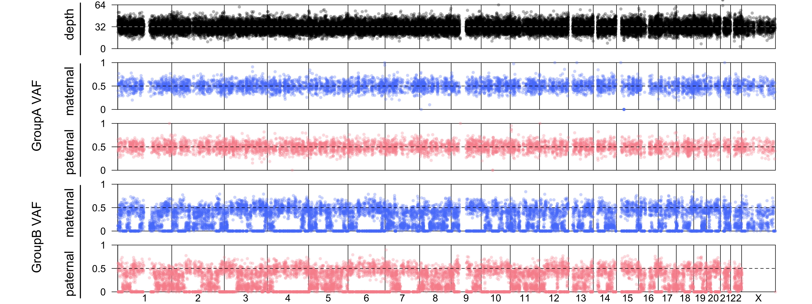

Plots
=====

.. _plots:

Normal male offspring, uncontaminated 
------------
.. image:: images/normal_male.plot.jpg
This is an example of SNP VAFs in a male offspring without contamination.

Normal female offspring, uncontaminated 
------------

This is an example of SNP VAFs in a female offspring without contamination.

Uniparental disomy
------------
.. image:: images/upid_example.jpg
Paternal uniparental isodisomy (UPiD) of chr4 is shown. Homozygosity of GroupA SNPs suggests the presence of uniparental disomy. Homozygosity of GroupB SNPs further suggests uniparental isodisomy (UPiD). 

Chimerism (from a sibling) ~ 22%
------------

The meiotic recombination pattern between the two sibling zygotes are shown as segmental VAF patterns in GroupB SNPs.

Maternal contamination in a placenta biopsy (~6.6% maternal DNA)
------------

Maternal blood can contaminate the fetal portions of the placenta biopsy. Maternal GroupA VAFs are increased and paternal GroupA VAFs are decreased (although the change may not be apparent). In GroupB, additional non-zero low level VAFs are seen only from the mother which suggests DNA contamination originating from the mother. 

Sample swap (father <-> offspring)
------------

Sample swap between the father and offspring would lead to no GroupA SNPs since a offspring and another parent can both be homozygous for a different allele at the same time (i.e. offspring: homo-alt, father:homo-ref). Thus, there is no GroupA variants. For GroupB SNPs, if the offspring is a *het* genotype, then the father can be a *het* or *homo-alt* genotype. Thus a *homo-alt* (VAF=1) is seen in GroupB in the parent that is swapped with an offspring.

Sample swap (mother <-> offspring)
------------

Sample swap between the mother and offspring would lead to no GroupA SNPs since a offspring and another parent can both be homozygous for a different allele at the same time (i.e. offspring: homo-alt, mother:homo-ref). Thus, there is no GroupA variants. For GroupB SNPs, if the offspring is a *het* genotype, then the mother can be a *het* or *homo-alt* genotype. Thus a *homo-alt* (VAF=1) is seen in GroupB in the parent that is swapped with an offspring.

Sample swap (father <-> mother)
------------
.. image:: images/father_mother_swap.counts.plot.jpg

In the absence of parent sample swap, GroupB is only seen with maternal SNP in chrX since the requirement for GroupB is heterozygous in that parent. For the father with XY genotype, therefore, GroupB SNP is not available. Thus, if the two parents are swapped, 'paternal' chrX GroupB SNPs will be observed instead of 'maternal' chrX GroupB.
