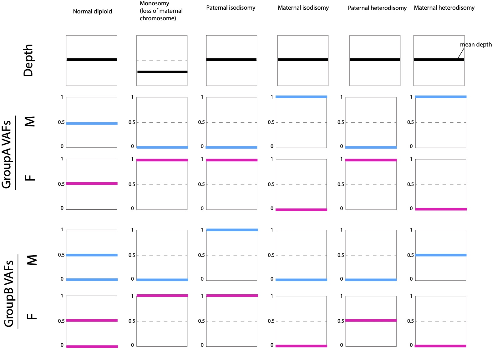

Uniparental disomy
=====

.. _upd:

Uniparental disomy
------------
Triomix can detect uniparental disomy (UPD) since Mendelian inheritance is violated. Using the VAF patterns of GroupA and GroupB SNPs, both uniparental isodisomy (UPiD) and uniparental heterodisomy (UPhD) can be detected. This can actually appear as paternal contamination in the case of paternal UPD (i.e. inheriting both chromosome from the father) or maternal contamination in the case of maternal UPD (i.e. inheriting both chromosome from the mother). 

Here, we show expected patterns of GroupA and GroupB SNPs in the case of various types of UPDs and also simple deletion cases.

