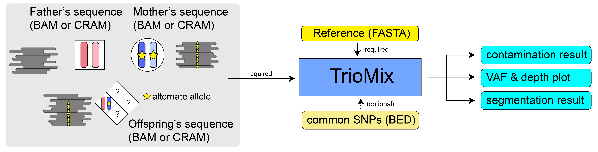

Usage
=====

.. _run:

TrioMix requires the input of sequence alignment file (BAM or CRAM files) of trios and a reference FASTA file. SNP BED file can be used as an optional argument. 

Basic Triomix command line: Detection of intrafamilial contamination in the offspring
------------

By default, TrioMix uses the parental genotypes (*GroupA, B, C SNPs*) to infer the intrafamilial contamination level in the offspring. Since ``-o`` is commonly reserved for outputs, we use ``-c, --child`` to refer to the offspring.  The basic command line of using TrioMix is the following:

.. code-block:: console

   $ python triomix.py -f father.bam -m mother.bam -c child.bam -r reference.fasta

.. code-block:: bash
   $ python triomix.py -h
   usage: triomix [-h] [--version] -f FATHER -m MOTHER -c CHILD -r REFERENCE [-s SNP] [-t THREAD] [-o OUTPUT_DIR]
                  [-p PREFIX] [--runmode {single,joint,all}] [-u {0,1}] [--parent] [-d DOWNSAMPLE]

   optional arguments:
     -h, --help            show this help message and exit
     --version             show program's version number and exit
     -f FATHER, --father FATHER
                           Father's BAM or CRAM file
     -m MOTHER, --mother MOTHER
                           Mother's BAM or CRAM file
     -c CHILD, --child CHILD
                           Child's BAM or CRAM file
     -r REFERENCE, --reference REFERENCE
                           Reference FASTA file
     -s SNP, --snp SNP     Optional list of SNP sites as a BED (or BED.gz) file
     -t THREAD, --thread THREAD
                           Multithread to utilize. Default=1
     -o OUTPUT_DIR, --output_dir OUTPUT_DIR
                           Output directory. Default=current working directory
     -p PREFIX, --prefix PREFIX
                           prefix for the output file. If not specified, will use the SM tag from the child bam's
                           header
     --runmode {single,joint,all}
                           Runmode for mle.R script. 'single' assumes only 1 contamination source within family.
                           'joint' calculates the fraction of all family members jointly. 'all' runs both modes.
                           Default=all
     -u {0,1}, --upd {0,1}
                           0: mle will filter out vaf=0 or 1 in sites where parental genotypes are homo-ref + homo-alt
                           (GroupA SNPs) 1: mle will identify UPDs which appears as contamination. Default=1
     --parent              Run detection of parental DNA contamination with child's DNA
     -d DOWNSAMPLE, --downsample DOWNSAMPLE
                           Downsampling for plotting.

Triomix command line with common SNP only
------------

Using a pre-selected list of common SNP would speed up the total runtime of TrioMix as the computation is limited to those regions instead of the entire genome. TrioMix provides a list of common ``GRCh38`` and ``GRCh37`` SNPs selected from the GnomAD database. These two files are included in the github repository as a `common_snp <https://github.com/cjyoon/triomix/tree/master/common_snp/>`_ folder.  A ``-s`` argument specifies the SNP database that can be used. User can provide one's own set of SNP in BED format.

.. code-block:: bash

   $ python triomix.py -f father.bam -m mother.bam -c child.bam -r reference.fasta -s common_snps/grch38_common_snps.bed.gz

Other optional arguments
------------

Default output files
------------
Triomix produces several output files files. 

``*.x2a.depth.tsv``: contains the depth ratio chrX vs autosome of each individual in a trio. Males are expected to have ~0.5 while female should have value ~1.0. 

``*.child.counts``: contains the position of the SNP loci in either GroupA, B, or C. Contains the read depths, alternative read counts for the trios. In addition, based on the parental genotype, will determine whether the child inherited the SNP from the father (F) or the mother (M). This file is used as the input for ``mle.R`` which estimates the contamination level using maximum likelihood estimation. 

``*.child.counts.upd.segments.tsv``: contains the VAF values for GroupA SNPs that have been segmented for UPD analysis

``*.child.counts.plot.pdf``: visualization of depth and VAF plots of GroupA and GroupB SNPs. 

``*.child.counts.summary.tsv``: contains the final estimated values of contamination from various sources in the child. Detailed information on each column is as follows.

.. code-block:: bash

   child_contam_by_sibling_joint # contamination estimated from joint analysis of all family members (GroupA + GroupB used)
   child_contam_by_father_joint # contamination estimated from joint analysis of all family members (GroupA + GroupB used)
   child_contam_by_mother_joint # contamination estimated from joint analysis of all family members (GroupA + GroupB used)
   convergence_joint # mle function convergence status. If 0, then indicates convergence succeeded. 
   child_contam_by_sibling # contamination estimated assuming only sibling contaminating (GroupB used)
   child_contam_by_father # contamination estimated assuming only father contaminating (GroupA used)
   child_contam_by_mother # contamination estimated assuming only mother contaminating (GroupA used)
   groupA_father # number of paternal GroupA variants identified
   groupA_mother # number of maternal GroupA variants identified
   groupB_father # number of paternal GroupB variants identified
   groupB_mother # number of maternal GroupB variants identified
   denovo_error_rate # fraction of alternative read count at GroupC SNPs

 

Triomix with whole-exome sequencing
------------
TrioMix can be used with whole-exome sequencing. In this case, we recommend running the command without the ``-s common_snp/common_snps.bed.gz``  to capture rare SNPs as well. This increases the overall number of SNPs while having minimal effect on the computational time due to smaller target in the exome sequeincing. For plotting, using ``-d 1`` is recommended to capture all data points in the plot without downsampling.

.. code-block:: bash

   $ python triomix.py -f father.bam -m mother.bam -c child.bam -r reference.fasta -d 1

Detection of intrafamilial contamination in the parent (i.e. parent DNA contaminated by child, or by another parent)
------------
To detect intrafamilial DNA contamination in the parent, ``--parent`` option can be used. This will use *GroupD SNPs* (where offspring's genotype is *homo-alt*) to detect the offspring DNA contaminating in the parents. 

.. code-block:: bash

   $ python triomix.py -f father.bam -m mother.bam -c child.bam -r reference.fasta -s common_snps/grch38_common_snps.bed.gz --parent

Additional output generated with ``--parent`` 
------------
``*.parent.counts``: 
``*.parent.counts.summary.tsv``
``*.parent.counts.plot.pdf``

.. code-block:: bash

  mother_contam_by_child  # contamination estimated in the mother (GroupD)
  father_contam_by_child  # contamination estimated in the father (GroupD)
  mother_contam_by_father # contamination estimated in the mother (GroupE)
  father_contam_by_mother # contamination estimated in the fother (GroupE)
  groupD_mother   # number of maternal GroupD variants identified
  groupD_father   # number of paternal GroupD variants identified
  groupE_mother   # number of maternal GroupE variants identified
  groupE_father   # number of paternal GroupE variants identified

Running TrioMix with a docker image
------------
Following example demonstrates how docker image can be used for runnint TrioMix.

.. code-block:: bash

   # Download docker image from dockerhub
   $ VERSION=v0.0.1 # download specific release version tag of TrioMix
   $ docker pull cjyoon/triomix:$VERSION

   # Run triomix with docker image
   $ docker run \
      -v /path/to/bamfile:/path/to/bamfile \ # bind all folders where input files are located 
      -v /path/to/reference:/path/to/reference/ \ 
      -v /path/to/output_dir:/path/to/output_dir \ # also bind the location of output folder
      -it cjyoon/triomix:$VERSION  \
         python /tools/triomix/triomix.py \ # location of triomix.py in the docker image 
            -f /path/to/bamfile/father.bam \ # location of father's bam file 
            -m /path/to/bamfile/mother.bam \ # location of mother's bam file 
            -c /path/to/bamfile/mother.bam \  # location of child's bam file 
            -s /tools/triomix/common_snp/grch38_common_snp.bed.gz \ # location of common SNP file in the docker image 
            -r /path/to/reference/reference.fa \ # location of reference FASTA file
            -o /path/to/output_dir # location where output files are saved

